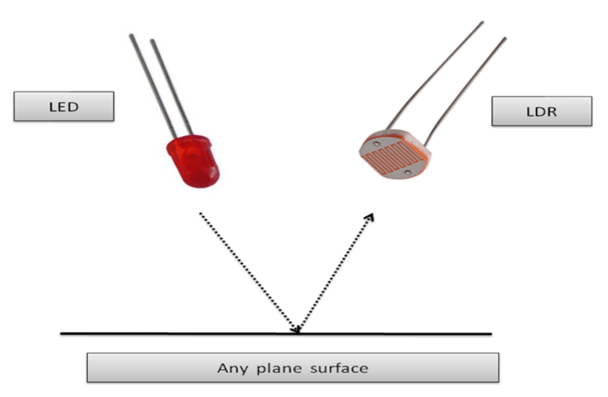
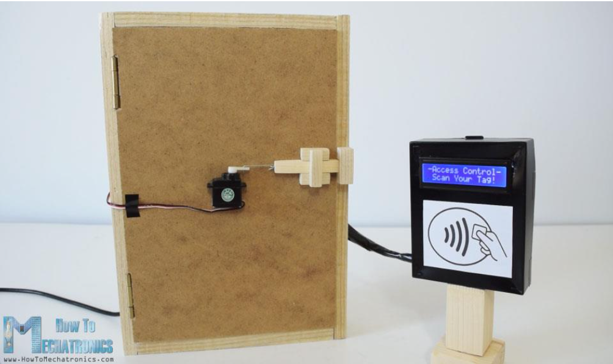
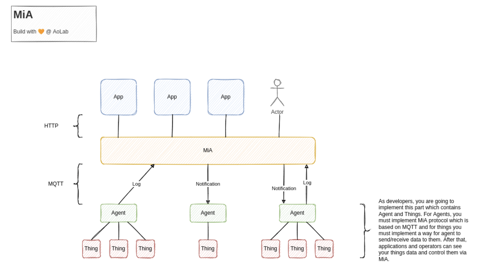

# Arduino Arcade

This repository contains some simple IoT projects and assignments using the NodeMCU ESP8266 board. The projects are
grouped in to three sets.

- Project Set A covers basic components like sensors and actuators to get started with NodeMCU and Arduino programming.
- Project Set B explores the WiFi capabilities of NodeMCU by building web interfaces and servers.
- Project Set C integrates an IoT device with the MiA middleware platform using MQTT. It adds authentication and the
  ability to control LED lights based on an LDR sensor reading.

The assignments include instruction and report PDFs (in Persian) explaining the projects in detail. Video demos of the
projects can be found [here]().

## Hardware Used

The following hardware components are used in these projects:

- NodeMCU ESP8266 development board
- Breadboard
- Jumper wires
- Resistors (330Ω and 10kΩ)
- LEDs
- SG90 Servo Motor
- SRF04 Ultrasonic Sensor
- LDR (Light Dependent Resistor)
- RC522 RFID Module

## Projects

### Set A: Getting Started with NodeMCU

1. Hello World: Print a hello message on the Arduino IDE serial monitor to verify setup and communication with NodeMCU
   board.

2. Button: Use an LDR photoresistor as a makeshift button. When hand is placed over LDR to block light, toggle an LED
   on. Remove hand to toggle LED off.

3. Line Follower: Use 3 LDRs to detect a black line on a white surface. If no line detected, red LED turns on and buzzer
   sounds. If middle LDR detects line, green LED turns on and servo stays still. If right LDR detects line, servo
   rotates right. If left LDR detects line, servo rotates left. This allows an imaginary line following robot to follow
   a black line. The general idea of this circuit can be seen in the figure below (figure not
   ours). 

4. Smart Bin: Use the ultrasonic sensor to detect hand proximity. When a hand is detected within set distance range,
   servo rotates to open an "imaginary" bin lid. (Figure not ours).

5. Screen Light: Use the LDR to detect ambient light level. Adjust brightness of an LED based on LDR reading to mimic
   auto phone brightness.

6. Attendance System: Use the RFID module to detect the scanned student ID cards. When the "professor" arrival is
   simulated by a button press (developed in section 2), start a 10 minute attendance window. If a student RFID tag is
   scanned within this window, record the attendance and rotate the servo to open the imaginary "door". If scanned after
   the window, buzz the buzzer. At the end, print a list of present and absent students based on RFID scans. Use NTP to
   timestamp all RFID scans.

### Set B: NodeMCU WiFi Capabilities

1. **Hostname:** Print the default hostname of the NodeMCU board which is in the format ESP-XXXXXX where X's are the MAC
   address. Set a custom hostname for the board and print the new hostname to the serial monitor.

2. **Station Mode:** Initialize the NodeMCU board in Station mode to connect to existing WiFi networks. Print the SSIDs
   of nearby WiFi networks scanned by the board to the serial monitor. Connect to a selected network in Station mode and
   print the assigned IP address of the board.

3. **Access Point Mode:** Configure the NodeMCU board in Access Point mode to act as a WiFi hotspot. Assign a static IP
   address to the board that is within the valid AP IP range and not already in use. Print the board's IP address in AP
   mode to the serial monitor.

4. **Vending Machine:** Host a simple web page on the NodeMCU IP address. Page has a student ID number, product
   selection, and balance. Students enter ID, select a product, and scan an RFID tag. Check the student's balance stored
   in memory, dispense the product by rotating a servo if balance sufficient and update balance. If insufficient
   balance, the servo stays still and an error is shown.

5. **Parking Door:** Host a page with buttons to open and close the door. When open is pressed, rotate a servo to open
   the door position, turn on an LED to indicate open state. If the door is left open for 20 seconds, automatically
   close. When closing, check for obstacles with an ultrasonic sensor. If an obstacle is detected, stop closing, open
   the door, buzz a buzzer and show an error on the page. (figure not ours) 

6. **Alarm:** Host a page to set an alarm time and volume. Use the NTP protocol to check the current time against the
   set alarm time. When the alarm time is reached, buzz a buzzer at the set volume. The page has buttons to snooze the
   alarm for 5 minutes or stop it completely.

### Set C: City Lights Control using MiA

[MiA](https://github.com/I1820/mia) is an IoT middleware developed at Amirkabir University that uses MQTT to connect
agents (like NodeMCU boards) and things (sensors and actuators).
It provides a full-featured package that can support expected capabilities from an IoT middleware platform, including
sending notification, collecting logs and discovering and managing "things". (Figure taken from MiA official Github
repository)

- **MiA Agent Authentication**: Implement authentication for MiA agents to securely connect to the MiA server. This
  involves generating encryption keys and passing credentials during the MQTT connection process.
- **Smart Streetlight**: Use an LDR photoresistor to simulate measuring streetlight brightness. Read the analog voltage
  from the LDR, map it to a 0-100 range, and publish this reading to the MiA server every 10 seconds using the proper
  data model for a light sensor.
  To simulate smart streetlights, set up 4 LEDs individually as light thing devices registered with MiA. When a request
  is sent via the MiA API to turn on one of the LED lights, look up the correct LED from the things list and turn it on
  to simulate a smart streetlight. Use the proper data model to define the LED lamps as thing devices.

## Contributors

- [Amirhossein Rajabpour](https://github.com/amirhossein-Rajabpour/)
- [Danial Hamdi](https://github.com/da-nial/)

## Course Information

- **Course**: Internet of Things
- **University**: Amirkabir University of Technology
- **Semester**: Spring 2022

Let me know if you have any questions!